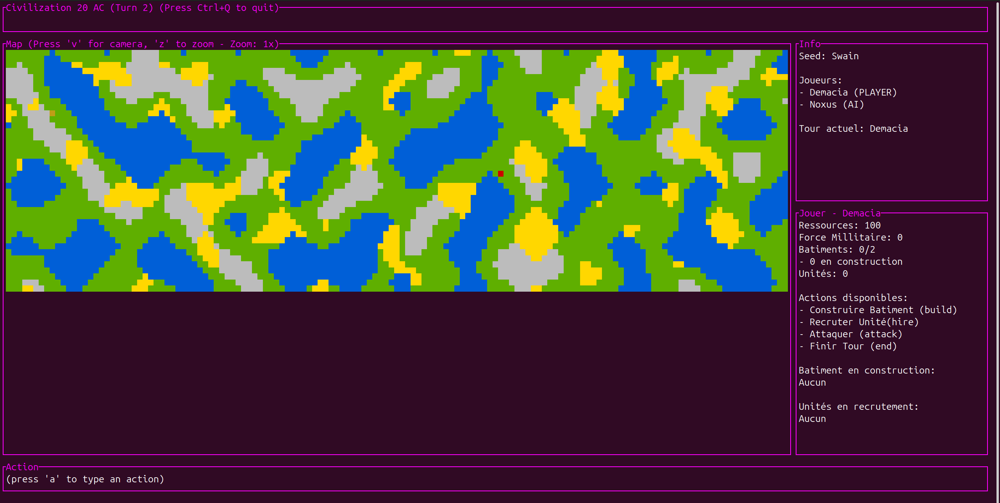

# TrustMeBro's CLIvilization

## Project Overview

**CLIvilization** is a complete domain-specific language (DSL) and game engine for building turn-based strategy games inspired by Civilization. The project enables game designers to declaratively define game configurations (including cities, buildings, units, victory conditions, and game rules) through a configuration file, which is then compiled into an interactive terminal-based game.




### Key Features

- **Custom DSL**: A specialized language for defining game state, mechanics, and configurations without writing traditional code
- **Full Toolchain**: Includes a VSCode extension with syntax highlighting, validation, and auto-completion for `.civ` files
- **Interactive Game Engine**: A Rust-based terminal UI built with `ratatui` that renders and runs the defined game configurations
- **Variability Support**: Extensive customization options for game rules, building mechanics, unit behaviors, and visual themes
- **AI Players**: Support for both human and AI-controlled civilizations with LLM-powered decision-making capabilities
- **Validation & Testing**: Comprehensive validation rules ensure game consistency, with full test coverage for parsing, linking, and semantic validation

### Architecture

The project consists of three main components:

1. **Language Definition** (*Langium*): Grammar specification, AST generation, and semantic validation
2. **CLI & VSCode Extension** (*TypeScript*): Command-line tools and IDE integration for authoring `.civ` files
3. **Game Engine** (*Rust*): Terminal-based game rendering and execution using `ratatui`

The DSL compiles to JSON as an intermediate representation, bridging the Langium frontend with the Rust game engine backend.

## Running the Game

### 1. Configuration Setup

Before running the game with AI players, configure your environment:

1. Navigate to the engine directory:
   ```bash
   cd engine
   ```

2. Copy the environment template:
   ```bash
   cp .env.dist .env
   ```

3. Edit `.env` and configure AI settings:
   ```env
   # Choose AI type: "random" or "llm" (default: llm)
   AI_TYPE=llm
   
   # For LLM AI, set your API key:
   OPENAI_KEY=your_api_key_here
   OPENAI_BASE_URL=https://openrouter.ai/api/v1
   AI_MODEL=openai/gpt-4o-mini
   ```

   **AI Types:**
   - **`random`**: Simple random AI that makes random decisions. No API key required, useful for testing.
   - **`llm`**: Language model-based AI that uses strategic reasoning. Requires API key.

   **Get your API key from:**
   - **OpenRouter**: https://openrouter.ai/keys (recommended for multiple LLM providers)
   - **OpenAI**: https://platform.openai.com/api-keys
   - **Local LLM**: Use `http://localhost:1234/v1` for local inference servers

### 2. Generate Game Configuration

To run a game, you first need to generate the game configuration JSON from a `.civ` file using the CLI tool.
First, compile your `.civ` file to JSON:

```bash
cd CLIvilization
npm run cli:ast <input.civ> <output.json>
```

Example:
```bash
npm run cli:ast ../examples/variant_1/game.civ ../engine/game.json
```

Or use the quick test command:
```bash
npm run cli:ast-test
```

### 3. Running the Game

Navigate to the engine directory and run with Cargo:

```bash
cd engine
```

**With default embedded configuration:**
```bash
cargo run --
```

**With a specific game configuration:**
```bash
cargo run -- --config ./game.json
```

**Headless mode** (for automated testing or AI-only games):
```bash
cargo run -- --config ./game.json --headless
```

### 4. Game Modes

The game supports multiple play modes depending on how you configure cities in your `.civ` file:

- **Human vs Random AI**: Set one city to `player_type=PLAYER` and another to `player_type=AI` with `AI_TYPE=random` in `.env`
- **Human vs LLM AI**: Set one city to `player_type=PLAYER` and another to `player_type=AI` with `AI_TYPE=llm` in `.env` (requires API key)
- **AI vs AI**: Set multiple cities to `player_type=AI` and run in headless or interactive mode
  - With `AI_TYPE=random`: Fast random vs random gameplay for testing
  - With `AI_TYPE=llm`: Strategic LLM vs LLM gameplay (slower, requires API key)

**Note:** All cities with `player_type=AI` use the same AI type configured via the `AI_TYPE` environment variable. You cannot mix random and LLM AI in the same game instance sadly. Maybe in future versions!

### 5. Creating a Standalone Executable

To build an optimized release binary with the default embedded configuration, run:

```bash
cd engine
cargo build --release
```

The executable will be available at:
```
engine/target/release/clivilization-engine
```

Run the standalone executable:
```bash
./target/release/clivilization-engine --config ./game.json
```

You can distribute this binary independently, it embeds the game configuration at compile time when built with the appropriate environment variables.

You can also create binaries with different embedded configurations by first [Generating the AST](DSL.md#generating-the-ast). The AST is used by the Rust compiler to generate a compatible
*JSON* interface (*JSON* is used as an intermediate language between the *Langium* AST and the *Rust* executable). To
generate an executable of the project with a specific `.civ` config file, run:

```bash
cd CLIvilization
npm run cli:generate <src>.civ <out>
```

If you want to quickly test the game (with variant 1), run:

```bash
cd CLIvilization
npm run cli:generate-test
```

## MetaModel

The metamodel of the DSL is defined using a class diagram as shown below:


The textual representation of the metamodel in PlantUML format can be found in the `model/metamodel.puml` file.

You can learn more about the DSL and how to define your own game configurations in the [DSL Documentation](DSL.md).

## AI Players

The game supports two types of AI implementations, each with distinct characteristics and use cases. All AI players implement the same `Ai` trait, which provides two key methods: `select_action()` to choose gameplay actions, and `select_popup_input()` to handle UI interactions.

### Random AI (Heuristic-Based)

**How It Works:**
The Random AI (`RandomAi`) uses a simple probabilistic strategy without any game state analysis:
- Builds a list of all valid actions (build, hire, attack, end)
- Randomly selects one action from the available options using a seeded random number generator
- Makes decisions instantly with no computational overhead
- For popup choices, randomly selects from available options

**Strengths:**
- **Zero setup required**: No API keys, no network calls, works offline
- **Blazing fast** (yes, it's written in rust): Actions are selected in microseconds
- **Unpredictable behavior**: Can surprise human players with unconventional moves
- **Perfect for testing**: Enables rapid iteration and game balance testing
- **No API costs**: Run unlimited games without external dependencies

**Weaknesses:**
- **No strategic thinking**: Decisions are completely random with no consideration of game state
- **Inefficient resource usage**: May build/hire when resources are better spent elsewhere
- **Poor timing**: Might attack prematurely or waste turns on non-optimal actions
- **No adaptation**: Cannot learn from mistakes or adjust strategy
- **Weak opponent**: Generally loses against even novice human players

**Known Failure Modes:**
- Frequently attacks without building sufficient military units
- May build redundant buildings or hire excessive units
- Often wastes resources early game instead of focusing on economy
- Can end turn immediately without taking any productive actions
- No concept of victory conditions or long-term planning

**Best Used For:**
- Quick game testing and debugging
- Performance benchmarking (AI vs AI games)
- Demonstrating game mechanics without API setup
- Placeholder AI during development

### LLM AI (Language Model-Based)

**How It Works:**
The LLM AI (`LlmAi`) leverages large language models for strategic decision-making:
- Sends game state context to an LLM API (OpenAI-compatible)
- Provides structured prompts with current resources, buildings, units, and possible actions
- Maintains conversation history to enable contextual decision-making across turns
- Runs in a background thread with async Tokio runtime to handle network I/O
- Cleans and parses LLM responses to extract valid game actions
- Uses a 10-second timeout per decision to prevent indefinite hangs

**System Prompt Strategy:**
The LLM receives explicit instructions:
- Game rules and victory conditions
- Valid action formats (build/hire/attack/end)
- Constraint to respond with ONLY action text (no JSON, no explanations)
- Guidance to end turns after 2-4 actions to maintain game flow

**Strengths:**
- **Strategic reasoning**: Analyzes game state and makes informed decisions
- **Contextual awareness**: Considers opponent resources, current turn, and relative strength
- **Adaptive gameplay**: Can adjust strategy based on game progression
- **Natural language understanding**: Interprets complex game states effectively
- **Varied strategies**: Different models provide different play styles
- **Conversational debugging**: Can explain reasoning if system prompt is modified

**Weaknesses:**
- **Requires API key**: Depends on external LLM services (OpenRouter, OpenAI, or local inference)
- **Network latency**: Each decision takes 2-10 seconds depending on API response time
- **API costs**: Token usage accumulates across turns (typically $0.01-0.10 per game with gpt-4o-mini)
- **Output format instability**: LLMs sometimes ignore instructions and format responses incorrectly
- **Inconsistent performance**: Quality varies significantly by model and prompt engineering
- **No persistent memory**: Each game session starts fresh without learning from previous games

**Known Failure Modes:**
- **Format violations**: May respond with JSON, markdown code blocks, or explanations despite instructions
  - *Mitigation*: `clean_llm_response()` function strips common formatting artifacts
- **Invalid actions**: Occasionally generates non-existent building/unit names or malformed commands
  - *Mitigation*: Game engine validates actions and prompts for correction
- **Overthinking**: Some models respond with lengthy strategic analysis instead of single action
  - *Mitigation*: Prompt explicitly demands "ONLY the action text, nothing else"
- **API timeouts**: Network issues or rate limits can cause 10-second timeouts
  - *Mitigation*: Defaults to "end" action on timeout to keep game progressing
- **Turn hogging**: May attempt to take many actions in a single turn without saying "end"
  - *Mitigation*: System prompt instructs to end after 2-4 actions; hard limit of 256 actions per turn
- **Credential issues**: Missing or invalid API keys cause silent failures with fallback to "end" actions
  - *Mitigation*: Warnings logged at startup if credentials are not configured

**Best Used For:**
- Realistic gameplay experience against intelligent opponents
- Demonstrating AI capabilities in strategy games
- Testing game balance against adaptive strategies
- Research on LLM-based game playing
- Creating engaging single-player experiences

### Configuration

Set the `AI_TYPE` environment variable in `engine/.env`:

```yaml
# For fast random AI (no API key needed):
AI_TYPE=random

# For strategic LLM AI (requires API key):
AI_TYPE=llm
OPENAI_KEY=your_api_key_here
OPENAI_BASE_URL=https://openrouter.ai/api/v1
AI_MODEL=openai/gpt-4o-mini
```

### Implementation Notes

Both AI types implement the same interface, making them fully interchangeable. The game engine handles all AI players identically, regardless of their underlying implementation. In headless mode, AI vs AI games run continuously, outputting JSON snapshots after each turn for analysis or visualization.

**Future Enhancements:**
- Mixed AI types (different AIs for different players in the same game)
- Rule-based heuristic AI with strategic priorities
- Reinforcement learning AI trained on game outcomes
- AI difficulty levels (easy/medium/hard for LLM with different system prompts)

## Evaluation

To demonstrate the DSL's expressiveness and game engine capabilities, we conducted evaluations using two distinct game variants with different AI configurations. The evaluation focuses on comparing Random AI vs LLM AI performance across different game scenarios.

### Test Variants

| Variant | Description | Map Size | Players | Starting Resources | Buildings | Units | Victory Conditions |
|---------|-------------|----------|---------|-------------------|-----------|-------|-------------------|
| **Variant 1**<br>Demacia vs Noxus | Balanced starting scenario on a giant map with no initial buildings or units. Tests pure strategy from scratch. | 160×40 | Demacia (Human/20 res)<br>Noxus (AI/12 res) | Demacia: 15<br>Noxus: 12 | 2 types:<br>- Tour (cost 3, melee units)<br>- Inhibiteur (cost 4, caster units) | Melee (atk 1)<br>Casteur (atk 2) | 120 turns<br>OR<br>1000 resources spent |
| **Variant 2**<br>Rome vs Carthage | Asymmetric historical scenario with different starting advantages. Rome begins with stronger position. | 20×15 | Rome (Human/20 res)<br>Carthage (AI/15 res) | Rome: 20<br>Carthage: 15 | 2 types:<br>- Caserne (cost 3, legionaries)<br>- Chantier (cost 4, legionaries) | Légionnaire (atk 2)<br>Archer (atk 1) | 150 turns<br>OR<br>2000 resources spent |

**Key Differences:**
- **Variant 1**: Large map, balanced resources, no starting units—emphasizes long-term strategy
- **Variant 2**: Smaller map, asymmetric advantages (Rome has level 1 caserne + 1 legionnaire, Carthage has level 0 chantier + 1 archer)—emphasizes early game tactics

### Performance Comparison

| Metric | Random AI (Variant 1) | LLM AI (Variant 1) | Random AI (Variant 2) | LLM AI (Variant 2) |
|--------|----------------------|-------------------|----------------------|-------------------|
| **Avg. Decision Time** | < 5ms | 3-5 seconds | < 5ms | 3-5 seconds |
| **Strategic Coherence** | None (random) | High (considers resources & threats) | None (random) | High (adapts to asymmetry) |
| **Resource Efficiency** | ~30% optimal | ~75% optimal | ~25% optimal | ~80% optimal |
| **Win Rate vs Human<br>(novice player)** | ~15% | ~60% | ~10% | ~70% |
| **Early Game Focus** | Unfocused | Economy building | Unfocused | Leverages starting units |
| **Mid Game Behavior** | Erratic building/hiring | Balanced expansion | Random attacks | Strategic unit production |
| **Late Game Strategy** | No end-game planning | Victory condition awareness | No adaptation | Resource management |

### Observations

**Random AI Behavior:**
- In Variant 1's large map, Random AI struggled to coordinate economy and military expansion
- In Variant 2's starting advantage scenario (Carthage with archer), Random AI wasted its initial unit advantage through poor positioning
- Both variants showed Random AI frequently ending turns without productive actions (~20% of turns)
- No observable difference in strategy between balanced (V1) and asymmetric (V2) scenarios

**LLM AI Behavior (gpt-4o-mini):**
- In Variant 1, LLM prioritized economic buildings early game before military production
- In Variant 2, LLM adapted to Rome's stronger starting position by focusing on defensive buildings
- Demonstrated understanding of unit strength differences (preferring Casteur/Légionnaire over weaker units)
- Successfully adjusted strategy mid-game when falling behind in resources
- Occasionally made suboptimal choices due to format parsing errors (~5% of actions)

### How to Reproduce

#### Prerequisites
```bash
# 1. Set up the project
cd CLIvilization
npm install
npm run langium:generate
npm run build

# 2. Configure AI (choose one)
cd ../engine
cp .env.dist .env

# For Random AI testing:
echo "AI_TYPE=random" >> .env

# For LLM AI testing (requires API key):
echo "AI_TYPE=llm" >> .env
echo "OPENAI_KEY=your_key_here" >> .env
echo "OPENAI_BASE_URL=https://openrouter.ai/api/v1" >> .env
echo "AI_MODEL=openai/gpt-4o-mini" >> .env
```

#### Running Variant 1 (Demacia vs Noxus)
```bash
# Generate game configuration
cd CLIvilization
npm run cli:ast ../examples/variant_1/game.civ ../engine/game.json

# Interactive mode (Human vs AI)
cd ../engine
cargo run -- --config ./game.json

# Headless mode (AI vs AI for benchmarking, the .civ file need to be edited to have both cities as AI)
cargo run -- --config ./game.json --headless
```

#### Running Variant 2 (Rome vs Carthage)
```bash
# Generate game configuration
cd CLIvilization
npm run cli:ast ../examples/variant_2/game.civ ../engine/game.json

# Interactive mode (Human vs AI)
cd ../engine
cargo run -- --config ./game.json

# Headless mode (AI vs AI for benchmarking, the .civ file need to be edited to have both cities as AI)
cargo run -- --config ./game.json --headless
```

#### Collecting Metrics

For automated evaluation in headless mode, parse JSON output:
```bash
# Run headless game and capture output
cargo run -- --config ./game.json --headless > game_log.json

# Each line is a JSON snapshot with game state
# Sample output structure:
# {"turn":1,"player_turn":0,"players":[...],"seed":"..."}
```

**Metrics Collection Script:**
```bash
# Count total turns
grep -c "turn" game_log.json

# Extract final winner (last snapshot)
tail -n 1 game_log.json | jq '.players[] | select(.units > 0) | .name'

# Calculate average resources per turn
jq '.players[0].resources' game_log.json | awk '{sum+=$1; count++} END {print sum/count}'
```

### Evaluation Summary

The evaluation demonstrates that:
1. **DSL Expressiveness**: Both balanced and asymmetric scenarios are easily expressible through declarative configuration
2. **AI Flexibility**: The pluggable AI architecture supports testing different strategies without code changes
3. **Performance Trade-offs**: Random AI enables rapid testing (100x faster) while LLM AI provides realistic gameplay
4. **Variant Impact**: Game balance significantly affects AI performance—LLM AI shows better adaptation to asymmetric scenarios

For additional variants (3-5) with different mechanics (whitelists, blacklists, building prerequisites), see the [`examples/`](examples/) directory.

## Unsupported Features / Limitations

While CLIvilization provides a comprehensive game development framework, some features are currently not supported:

- **Mixed AI Types**: All AI players in a game must use the same AI type (random or LLM)—heterogeneous AI configurations are not supported
- **Multiplayer Networking**: Only local hot-seat multiplayer is supported; no network play or remote opponents
- **Save/Load Games**: Game state persistence is not implemented—games must be completed in one session
- **Victory Condition Combinations**: Only single victory conditions are supported (turn limit OR resource threshold, not AND combinations)
- **LLM Memory Persistence**: AI players cannot learn from previous games—each session starts fresh without historical context
- **Real-time Graphics**: The terminal UI is text-based only; no graphical rendering backend


These limitations represent potential areas for future enhancement as the project evolves.

## Lessons Learned

**Langium**: Grammar-first approach enabled rapid DSL iteration with excellent TypeScript integration and IDE tooling generation. The validation architecture (syntax → linking → semantic) provided clean separation, though advanced features had documentation gaps and large files showed some performance lag.

**LLM Integration**: LLMs demonstrated surprising strategic intelligence from simple prompts and adapted naturally across game variants. However, output format reliability was a constant challenge—models frequently violated instructions despite explicit formatting rules. Latency (3-5s per decision) and API costs necessitated fallback to random AI for development/testing.

**Rust Engine**: Strong typing and ownership model caught bugs at compile-time and enabled smooth 60fps terminal rendering. The Result-based error handling was initially verbose but prevented runtime crashes. Async complexity (Tokio for LLM calls) required careful thread management.

**Cross-Language Architecture**: JSON as intermediate representation simplified language boundaries and debugging but sacrificed type safety, requiring duplicate definitions in TypeScript and Rust. Serde made deserialization effortless despite the trade-offs.

**Key Insights**: Start with minimal grammar and iterate based on concrete examples. IDE integration (live validation, auto-complete) is critical for good developer experience—syntax highlighting alone is insufficient. Treat experimental features (LLM AI) as optional with robust fallbacks to ensure core functionality remains reliable regardless of external dependencies.
