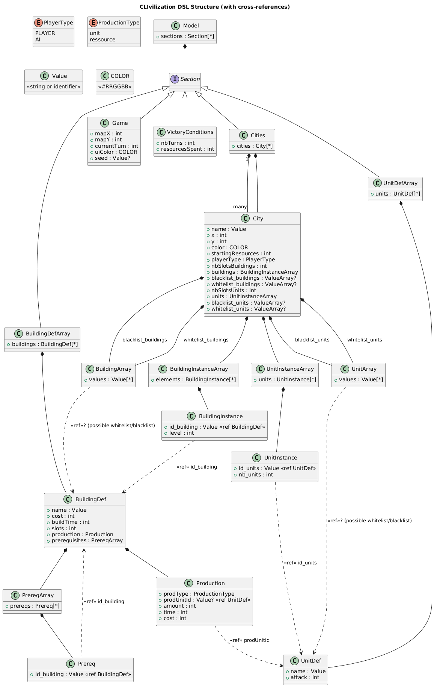

# TrustMeBro's CLIvilization

## MetaModel

The metamodel of the DSL is defined using a class diagram as shown below:

The textual representation of the metamodel in PlantUML format can be found in the `model/metamodel.puml` file.